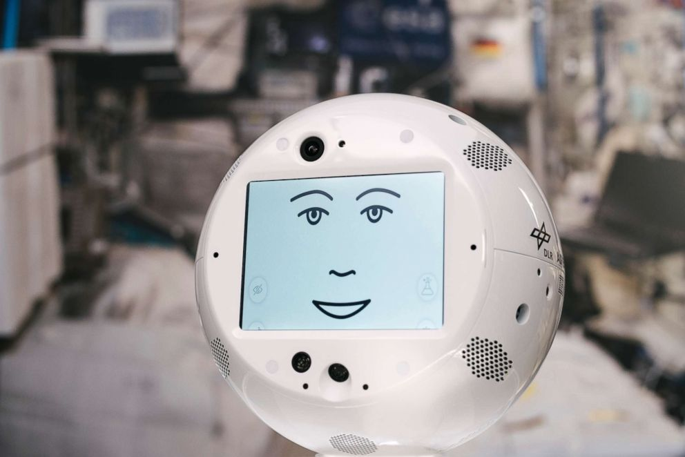

# ai-case-study
# SPACE X and the use of AI for space exploration

    

 

## Overview and Origin

Space X is a space exploration company mainly private founded by Elon Musk on 2002. Elon Musk has as one of his biggest passions space exploration, on 2002 he was looking at the NASA schedule to send astronauts to Mars and was shocked to see that there was no timeline. He decided to meet with aerospace engineers to discuss founding a space launch company. After selling PayPal he decided to invest $100 Million in the founding of Space X with the goal of reducing space transportation costs and ultimately developing a sustainable colony on Mars.
Even tho Space X was funded with his own money, the company has gained enough experience to attract the monetary support from NASA to develop his rockets and spacecraft, and to bring cargo to the ISS.Space X just succesfully launched a skycraper- sized rocket into the orbit, this latest success could reach $1 trillion valuation. Currently Space X is valuated at $180 billion (America's most valuable private company)

## Business Activities

 Space X is trying to reduce human error while ensuring that flights are efficient and safe, this being one of the main reasons of the company uses an AI powered autopilot program for rockets. this makes the rockets launch themselves to the ISS- docking station. Based on the trajectory of the rockets to certain point in space the AI system measures weather, fuel reserves & usage,parabolic flight, liquid engine slohing and more factors that affect rockets flights.

Thanks to all the advantages named before and more, Space x has achived contracts for its space services from private and public organizations. Their main contracts are with NASA (to carry cargo and astronauts to the international space station.) and then US department of defense to launch two Falcon Heavy rockets for space test programme. Space X is a company that has continued advance in space technology and is always creating new business opportunities. One of its biggest advanges is its reusable rockets, they can reuse their boosters over and over for any type of mission, which in the past was almost impossible. The Falcon 9, can independently return to earth and land vertically on a predetermined platform, thanks to the company's AI driven technology. Ai has reduced human error in its rockets, they will set a trajectory for a certain point in space and will by navigated by an autopilot until landing phase of the mission.This permits humans to work on space exploration and investigation without worring on the trajectory. machine learning and data science are used to create convex optimization algorithm. Even the evacuation system is Ai powered to return humans safe to earth. CIMON is an AI computer head responsible to assist astronauts with their routines and science speriments, this AI isn't self trained as is not the comany intention for Ai to replece astronauts but to help, entretain, warn them about malcfuntions.

    

 
Space X not only uses AI for their self driven rockets but also for their satellites, this are able to navigate themselves in space and down to earth, this satellites 
are equiped with sensors that prevent collision with any material.AI processed data found the patters in satellites, space materials or debris and planets.

## Competitors
1. Blue Origin: Jeff Bezos, the CEO of Amazon, created Blue Origin in 2000. It is a spaceflight services and aerospace manufacturer. In an effort to make space travel 
     more accessible and inexpensive, Blue Origin, like SpaceX, is concentrating on constructing reusable rockets and spacecraft. (Source: Blue Origin, n.d.) 
     2. United Launch Alliance (ULA): ULA, a joint venture between Boeing and Lockheed Martin, offers launch services to both government and private clients. Although ULA's 
     rockets are not reusable like those of SpaceX and Blue Origin, they have a strong track record of dependability and have launched many well-known missions, such as 
     NASA's Mars rovers and the New Horizons mission to Pluto. (ULA, n.d.) 
     3. Virgin Galactic: Richard Branson created Virgin Galactic, a space transportation business, in 2004. Virgin Galactic is concentrated on suborbital space tourism, as 
     opposed to SpaceX and Blue Origin, who are concentrated on orbital launches and interplanetary exploration. The business has created the SpaceShipTwo, a reusable 
     spacecraft that can transport paying passengers to and from the edge of space."(Course Sidekick, page 16)

## Results

    

 
"With an ever-increasing launch cadence, SpaceX has surpassed other launch providers by annual vehicles launched and continues, nearly year-on-year, to set vehicle flight records." (spacexstats.xyz)

## Recommendations

I would recommend space tourism, Orbital and Sub Orbital trips. This business was left to a side in the past due the cost as a main barrier. Space X has the capacity to 
make this a m,ore affordable market thanks to their rehusable rockets. Current stimates place space tourism market at $870 Million. And their competitors Virgin Galactic 
are already working on this but with flights costing hundreds of thousands of dollars.

## References

https://medium.com/@DisruptionHedge/spacex-1-trillion-valuation-and-the-new-era-of-investing-2685ed99daf6
https://www.coursesidekick.com/marketing/658202#:~:text=9%20As%20part%20of%20its,spacecraft%20are%20company%27s%20main%20offering.
https://www.spacexstats.xyz/#launchhistory-per-year
https://www.spacex.com/
